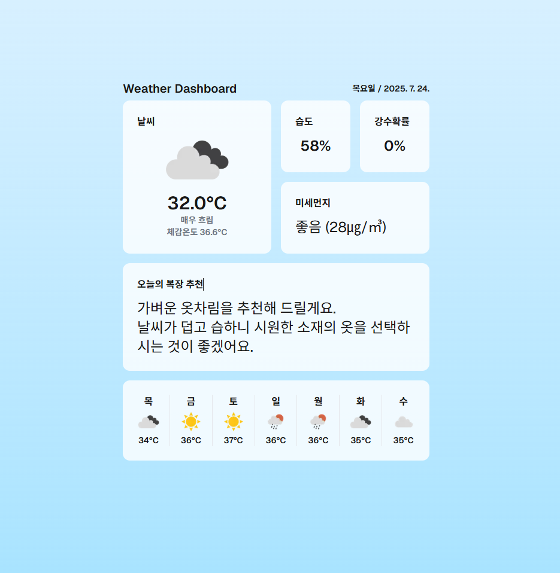

# Smart Weather Dashboard

패션과 날씨에 무심한 개발자 혹은 옷을 준비하며 날씨를 간단히 확인하려고 하는 사용자를 위해 사용자 현재 위치를 기반으로 실시간 날씨와 AI 기반 복장 추천을 제공하는 날씨 대시보드입니다.

<!--  스크린샷 -->

## 주요 기능

- **위치 기반 날씨 정보** (OpenWeather API)
- **Gemini AI 복장 추천** (Google GenAI 사용)
- **Redis 캐시** API 비용 및 응답 속도 최적화
- 반응형 UI 및 Skeleton 기반 로딩 UX

## 기술 스택

- **Next.js 15** (App Router)
- **TypeScript**, **React 19**
- **Tailwind CSS 4**
- **Redis** (캐싱 용도)
- **Google GenAI (Gemini 2.0 Flash)**

## 실행 방법

```bash
# 패키지 설치
npm install

# 개발 서버 실행
npm run dev
```
